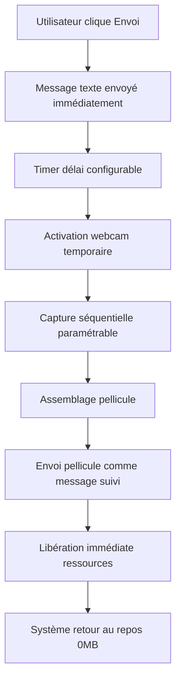

# 🚀 OGMA PERCEPTION V2.0 - SPÉCIFICATIONS D'UPGRADE

## 📋 Vue d'ensemble

### Objectif
Transformer le système de perception OGMA d'un **buffer permanent consommateur de ressources** vers un **système de capture déclenchée post-envoi** ultra-performant et contrôlé par l'utilisateur.

### Vision
- **Ressources** : 0MB RAM au repos (vs 2.7MB permanent)
- **Performance** : -99% utilisation système
- **Contrôle** : Timing précis par l'utilisateur
- **Simplicité** : Architecture beaucoup plus simple

---

## 🎯 Analyse comparative

### ❌ Système actuel (Buffer permanent)
```
RAM : 2.7MB permanent (24h/24)
CPU : Thread continu actif
Disque : 86,400 écritures/jour
Webcam : Accès permanent
Complexité : Thread + Cache + Rotation
```

### ✅ Nouveau système (Capture déclenchée)
```
RAM : 0MB repos → 2.7MB temporaire capture
CPU : Actif SEULEMENT lors captures  
Disque : ~60 écritures/jour maximum
Webcam : Activation à la demande
Complexité : Capture linéaire simple
```

### 📊 Économies attendues
- **RAM** : -100% au repos
- **Disque I/O** : -99.93% (60 vs 86,400 écritures/jour)
- **CPU** : -95% activité (10min vs 24h)
- **Complexité code** : -80%

---

## 🏗️ Architecture technique

### Nouveau flux de fonctionnement



### Nouveaux paramètres utilisateur

| Paramètre | Plage | Défaut | Description |
|-----------|--------|---------|-------------|
| `delai_capture` | 0-10s | 3s | Délai avant début capture |
| `intervalle_images` | 0.1-2s | 0.5s | Temps entre captures |
| `nombre_images` | 1-12 | 6 | Nombre d'images à capturer |
| `mode_capture` | simple/motion/timeline | motion | Type de capture |
| `save_captures` | bool | false | Sauvegarde locale |

---

## 📂 Plan d'implémentation

### Phase 1 : Préparation et sauvegarde
```bash
# Sauvegarde sécuritaire
cp extensions/perception_agent.py extensions/perception_agent_buffer_backup.py
cp extensions/perception_ui.py extensions/perception_ui_backup.py
cp data/settings.json data/settings_backup_avant_upgrade.json

# Tag git de sécurité
git tag -a "perception-v1-backup" -m "Backup avant upgrade vers capture déclenchée"
git push origin perception-v1-backup
```

### Phase 2 : Développement nouveau système

#### 2.1 Nouvelle classe `CaptureOnDemand` 
**Fichier :** `extensions/perception_agent_v2.py` (nouveau)

```python
class CaptureOnDemand:
    """
    Système de capture déclenchée - ZÉRO ressource au repos
    """
    def __init__(self):
        # Configuration utilisateur
        self.config = {
            'delai_capture': 3.0,
            'intervalle_images': 0.5, 
            'nombre_images': 6,
            'mode_capture': 'motion',
            'save_captures': False
        }
        
        # État - AUCUN thread permanent !
        self.webcam = None
        self.capture_active = False
    
    async def capture_post_envoi_async(self):
        """CŒUR du nouveau système"""
        # 1. Attendre délai configuré
        # 2. Activer webcam temporairement  
        # 3. Capture séquentielle
        # 4. Assemblage pellicule
        # 5. Libération immédiate ressources
        pass
    
    def _init_webcam_temporaire(self):
        """Activation webcam SEULEMENT pour capture"""
        pass
        
    def _cleanup_webcam(self):
        """Libération IMMÉDIATE ressources"""
        pass
```

#### 2.2 Interface utilisateur mise à jour
**Fichier :** `extensions/perception_ui.py`

Nouveaux contrôles à ajouter :
```python
# Délai capture
ui.slider('Délai capture', min=0, max=10, step=0.1, value=3.0)

# Intervalle images  
ui.slider('Intervalle images', min=0.1, max=2.0, step=0.1, value=0.5)

# Nombre d'images
ui.slider('Nombre d\'images', min=1, max=12, step=1, value=6)

# Mode capture
ui.select(['simple', 'motion', 'timeline'], value='motion')

# Compte à rebours visuel (nouveau)
ui.circular_progress('Capture dans...', show_percentage=False)
```

#### 2.3 Intégration envoi message
**Fichier :** `ogma_ng.py`

Modification fonction `_send_message()` :
```python
async def _send_message_avec_capture():
    # 1. Envoyer message texte immédiatement
    await send_text_message(user_input)
    
    # 2. Déclencher capture post-envoi SI activée
    if perception_enabled and capture_on_send:
        # Démarrer timer + feedback visuel
        asyncio.create_task(
            perception_agent.capture_post_envoi_async()
        )
```

### Phase 3 : Migration progressive

#### 3.1 Système dual (transition)
- Flag `use_new_capture_system` dans settings.json
- Ancien système conservé temporairement
- Interface pour basculer entre modes
- Tests utilisateurs volontaires

#### 3.2 Migration données
Script `migrate_perception_settings.py` :
```python
def migrer_settings():
    # Conversion anciens paramètres → nouveaux
    old_settings = load_settings()
    
    new_perception_config = {
        'delai_capture': 3.0,  # Nouvelle valeur par défaut
        'intervalle_images': 0.5,
        'nombre_images': 6,
        'mode_capture': 'motion',
        'save_captures': old_settings.get('save_captures', False)
    }
    
    # Préservation paramètres compatibles
    # ...
```

---

## 🧪 Stratégie de tests

### Tests unitaires
- [ ] Initialisation `CaptureOnDemand`
- [ ] Configuration paramètres
- [ ] Capture simple image
- [ ] Capture séquence motion  
- [ ] Assemblage pellicules
- [ ] Gestion erreurs webcam
- [ ] Libération ressources complète

### Tests d'intégration
- [ ] Flux complet : envoi → délai → capture → pellicule
- [ ] Synchronisation UI ↔ Agent
- [ ] Persistance settings
- [ ] Compatibilité capture manuelle
- [ ] Gestion concurrence webcam

### Tests de performance
- [ ] **CRITIQUE** : RAM = 0MB au repos
- [ ] Temps activation webcam < 1s
- [ ] Latence capture séquentielle
- [ ] CPU usage pendant capture
- [ ] Libération complète post-capture

### Tests UX
- [ ] Compte à rebours visuel fluide
- [ ] Feedback états capture
- [ ] Messages d'erreur clairs
- [ ] Configuration intuitive
- [ ] Expérience envoi → pellicule fluide

---

## 🎮 Scénarios d'usage optimisés

### 🎯 Démonstration technique
```
Paramètres : Délai 5s, Images 8, Intervalle 0.4s
Flux :
1. "Je vais vous montrer le problème" → Envoi
2. Utilisateur prépare pendant les 5s  
3. Capture 8 images en 3.2s
4. Pellicule assemblée et envoyée
```

### 🎯 Réaction instantanée
```
Paramètres : Délai 1s, Images 3, Intervalle 0.2s
Flux :
1. "Regardez ma réaction" → Envoi
2. Capture quasi-immédiate 
3. Courte séquence 0.6s
```

### 🎯 Documentation processus
```
Paramètres : Délai 3s, Images 12, Intervalle 1s  
Flux :
1. "Voici la procédure" → Envoi
2. Processus lent et détaillé
3. Séquence longue 12s
```

### 🎯 Urgence instantanée
```
Paramètres : Délai 0s, Images 1, Mode simple
Flux :
1. Événement urgent → Envoi immédiat
2. Capture instantanée sans délai
```

---

## ⚠️ Gestion des risques

### Risques identifiés et solutions

| Risque | Probabilité | Impact | Solution |
|--------|-------------|---------|----------|
| Webcam occupée | Moyenne | Moyen | Tests occupation + retry + fallback |
| UI figée pendant capture | Faible | Faible | Threads asynchrones + indicators |
| Perte settings migration | Faible | Élevé | Backup automatique + rollback |
| Régression capture manuelle | Faible | Moyen | Tests compatibilité + flag legacy |

### Plan de rollback

1. **Détection problème** : Monitoring erreurs + feedback utilisateurs
2. **Rollback immédiat** : Flag `use_legacy_buffer = true`
3. **Restauration data** : `settings_backup_avant_upgrade.json`
4. **Git revert** : Retour version précédente si nécessaire

---

## 📅 Timeline d'implémentation

### Semaine 1 : Préparation
- [x] Analyse et spécifications ✅
- [ ] Sauvegardes sécuritaires
- [ ] Setup environnement test
- [ ] Architecture nouvelle classe

### Semaine 2 : Développement core
- [ ] `CaptureOnDemand` classe complète
- [ ] Tests unitaires de base
- [ ] Interface utilisateur nouveaux paramètres
- [ ] Intégration ogma_ng.py

### Semaine 3 : Tests et intégration  
- [ ] Tests d'intégration complets
- [ ] Tests performance (RAM, CPU, etc.)
- [ ] Interface utilisateur finale
- [ ] Documentation utilisateur

### Semaine 4 : Déploiement progressif
- [ ] Système dual (ancien + nouveau)
- [ ] Tests utilisateurs volontaires
- [ ] Corrections bugs identifiés
- [ ] Migration complète

---

## 🔍 Critères de succès

### Métriques techniques
- ✅ **RAM au repos = 0MB** (vs 2.7MB actuel)
- ✅ **CPU repos = 0%** (vs thread permanent)  
- ✅ **Disque I/O < 100 écritures/jour** (vs 86,400)
- ✅ **Temps activation webcam < 1s**
- ✅ **Libération ressources complète post-capture**

### Métriques UX
- ✅ **Compte à rebours visuel fluide**
- ✅ **Configuration paramètres intuitive**
- ✅ **Feedback états capture claire**
- ✅ **0 régression fonctionnalités existantes**

### Métriques stabilité
- ✅ **0 crash lié nouveau système** 
- ✅ **Rollback fonctionnel testé**
- ✅ **Migration settings 100% succès**
- ✅ **Compatibilité capture manuelle préservée**

---

## 📝 Notes importantes

### Points d'attention critique
1. **ZÉRO régression** : Fonctionnalités actuelles préservées
2. **Rollback testé** : Plan B opérationnel avant déploiement  
3. **Performance mesurée** : Métriques avant/après documentées
4. **UX préservée** : Expérience utilisateur égale ou supérieure

### Validation finale requise
- [ ] **Tests performance complets** sur machine de référence
- [ ] **Tests utilisateurs** avec panel représentatif  
- [ ] **Code review** architecture et sécurité
- [ ] **Documentation** complète pour utilisateurs et développeurs

---

## ✅ Autorisation d'implémentation

**⚠️ IMPLÉMENTATION CONDITIONNELLE**

Ce document constitue la **spécification complète** pour l'upgrade OGMA Perception V2.0.

**L'implémentation ne débutera QU'AVEC l'autorisation explicite** de validation de ces spécifications.

**Status** : 🟡 **EN ATTENTE D'AUTORISATION**

---

*Document généré le 18/10/2025 - OGMA Perception Upgrade Specifications v1.0*