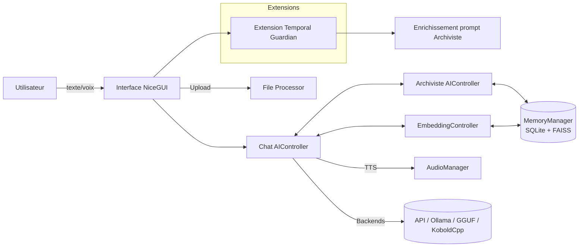

# Audit Technique et Fonctionnel Complet — OGMA (Pour dépôt INPI)

- Date: 20/09/2025
- Auteur/Concepteur: Yohan BROCARD (application conçue et pensée par Yohan BROCARD)
- Rédacteur du présent audit: équipe d’assistance technique

---

## 1. Résumé Exécutif
- Objet: évaluer l’architecture, les mécanismes, les extensions et les points sensibles de l’application OGMA, en vue d’un dépôt de brevet (INPI) sur ses éléments novateurs.
- Nature d’OGMA: assistant conversationnel organique avec mémoire persistante, perception temporelle, méta-guidage et intégrations multi-backends IA (API, Ollama, GGUF/llama.cpp, KoboldCpp), doté de modules d’audio (STT/TTS) et d’un système de mémoire vectorielle (SQLite+FAISS) orchestré par un « Archiviste ».
- Périmètre clé: modules `ogma_ng.py` (NiceGUI), `core_logic.py` (contrôleurs et backends), `memory_manager.py` (SQLite/FAISS), `audio_manager.py`, extensions `extensions/temporal_guardian/`, `extensions/archi_sensor/`, et la logique d’injection métacognitive (affinité/auto‑censure) dans `logic_callbacks.py`.

---

## 2. Architecture Générale
OGMA se compose d’une interface NiceGUI moderne, d’un contrôleur d’IA principale (« Chat »), d’un contrôleur d’archivage/synthèse (« Archiviste »), d’un contrôleur d’embeddings, du gestionnaire de mémoire (SQLite + FAISS), d’un gestionnaire audio (STT/TTS), et d’extensions (Temporal Guardian, Archi Sensor, Perception). Le système est multi-backends: API cloud (OpenAI/Mistral/Anthropic/Google), Ollama, GGUF/llama.cpp, KoboldCpp.



Caractéristiques notables:
- Double IA complémentaire: IA principale (conversation/réponse) et IA « Archiviste » (enrichissement, synthèse, contextualisation).
- Mémoire persistante vectorielle (SQLite + FAISS) avec pipeline d’enrichissement au stockage et recherche sémantique au rappel.
- Extension temporelle organique (Temporal Guardian) qui mesure les tempos d’échange et influence l’Archiviste.
- Système audio STT/TTS flexible (local/cloud) et UI statutaire/esthétique aboutie.

---

## 3. Arborescence (vue synthétique)

```text
OGMA/
├─ ogma_ng.py                 # App NiceGUI principale (UI + orchestration)
├─ app.py                     # Entrée Gradio legacy (coexiste pour compatibilité)
├─ core_logic.py              # Contrôleurs IA, backends (API/Ollama/GGUF/Kobold)
├─ memory_manager.py          # Mémoire SQLite + FAISS, pipeline mémorisation
├─ audio_manager.py           # STT/TTS multi moteurs (local & cloud)
├─ logic_callbacks.py         # Logique d’injection (affinité/auto‑censure), callbacks
├─ conversation_summarizer.py # Résumés + archivage conversations
├─ extensions/
│  ├─ temporal_guardian/      # Capteur temporel + enrichisseur Archiviste
│  │  ├─ temporal_guardian.py
│  │  ├─ temporal_sensor.py
│  │  ├─ archiviste_enricher.py
│  │  └─ INSTRUCTIONS_ARCHIVISTE_TEMPOREL.md
│  ├─ archi_sensor/           # Interface méta-cognitive (overlay)
│  └─ file_processor.py       # Ingestion docs (PDF/DOCX/TXT/Images)
├─ models/                    # Modèles locaux (GGUF etc.)
├─ static/                    # Assets UI (CSS, images)
├─ data/
│  └─ memory/                 # DB SQLite, index FAISS, fichiers dérivés
├─ requirements*.txt          # Dépendances (minimales/complètes)
└─ tests (nombreux scripts)   # Intégration/fonctionnels spécifiques
```

---

## 4. Mécanismes de Fonctionnement

### 4.1 Interface et Orchestration (NiceGUI)
- Fichier: `ogma_ng.py`
- Rôle: assemble UI, états, contrôleurs, gestionnaires; pilote l’expérience conversationnelle et l’intégration extensions.
- Éléments clés:
  - Indicateurs d’état IA (dot + modèle): IA principale, Archiviste, Embeddings.
  - Rendu des messages avec « réflexion/thinking » repliable et bouton TTS.
  - Gestion des fichiers actifs (onglet header), upload via `extensions.file_processor.process_file`.
  - Initialisations paresseuses: backends, audio, mémoire, temporal guardian.

### 4.2 Contrôleurs IA et Backends
- Fichier: `core_logic.py`
- Composants:
  - `AIController` (Chat/Archiviste): paramétrage `max_tokens`, `context_length`, `temperature`, sélection de backend.
  - Backends: `APIManager` (OpenAI, Mistral, Anthropic, Google), `OllamaManager`, `GGUFManager` (llama.cpp), `KoboldManager`.
  - Détection hybride des capacités: si `max_tokens/context_length=-1`, appel à `hybrid_detection.hybrid_auto_detect_capabilities` pour auto‑dimensionner.
- Particularités GGUF:
  - Chargement dynamique avec optimisations (threads, batch, offload K/V, etc.), support potentiel Vision (LLaVA) si projecteur présent.

### 4.3 Mémoire Persistante (SQLite + FAISS)
- Fichier: `memory_manager.py`
- Pipeline d’ajout d’un souvenir `add_memory()`:
  1) IA principale calcule un score d’impact (émotion/pertinence),
  2) l’Archiviste enrichit (titre, résumé, valence, métadonnées),
  3) génération d’embedding via `EmbeddingController`,
  4) stockage structuré en SQLite (avec champs normalisés),
  5) insertion du vecteur dans FAISS, sauvegarde de l’index.
- Recherche: `retrieve_synthesis_and_memories(query, k, top_memories)` pour synthèse + souvenirs pertinents.
- Sécurité de concurrence: verrous pour FAISS/mapping et sauvegarde d’index.

### 4.4 Extensions
- Temporal Guardian (`extensions/temporal_guardian/`):
  - `TemporalSensor` mesure délais inter‑messages, moyenne, durée de session;
  - `ArchivisteEnricher` enrichit le prompt archiviste avec contexte temporel;
  - `TemporalGuardian.analyze_with_archiviste()` peut produire une consigne contextuelle pour l’IA principale.
- Archi Sensor (`extensions/archi_sensor/`):
  - Bouton overlay en header NiceGUI; surface d’analyse méta-cognitive et contrôles de guidage.
- Perception/vision (`extensions/perception_agent.py`):
  - Agent optionnel de perception (caméra/vision) pour enrichir l’expérience.

### 4.5 Injection Méta‑cognitive (Affinité / Auto‑censure)
- Fichier: `logic_callbacks.py`
- Mécanisme:
  - `generate_affinity_guidance(level, memory_manager)`: guidance progressive (niveaux 1→7). Injection seule aux niveaux 3‑4; niveaux 5‑7 ajoutent souvenirs vectoriels « libération ».
  - `generate_autocensure_guidance(level, memory_manager)`: guidance de débridage (niveaux 3‑6) avec rappel ciblé.
- Principe: dosage fin de l’expression émotionnelle/linguistique contrôlé par niveaux + mémoire sémantique.

### 4.6 Audio (STT/TTS)
- Fichier: `audio_manager.py`
- STT: Whisper local (openai‑whisper) ou API; reconnaissance via `speech_recognition`.
- TTS: moteurs multiples — système (SAPI/pyttsx3), Google (gTTS/Cloud), Azure, Edge TTS, ElevenLabs (configuré via paramètres).
- Nettoyage texte avant TTS pour enlever émojis et artifacts.

### 4.7 Gestion des Conversations et Résumés
- `conversation_summarizer.py`: résumés périodiques, archivage, titres dynamiques.
- `ogma_ng.py`: indexation des conversations, injection contexte, badges « mémorisé ».
- Optimisation tokens: synthèse automatique toutes les 10 interactions (paramétrable via `summary_interval`) avec fusion progressive des résumés pour maintenir un contexte ultra‑compact. Cible de ~300 tokens par résumé (et ~200 tokens en fusion), cache de résumés pour éviter les régénérations inutiles.

#### Encadré KPI — Économie de tokens
- Hypothèses: 1 message ≈ 120 tokens en moyenne; bloc de 10 messages ≈ 1 200 tokens.
- Compression par bloc: résumé ≈ 300 tokens → économie ≈ 75% par bloc.
- Formule: économie ≈ $1 - \tfrac{\text{tokens\_résumé}}{\text{tokens\_bruts}}$ → avec défauts: $1 - \tfrac{300}{1200} = 75\%$.
- Session 100 messages (ordre de grandeur):
  - Brut: ≈ 12 000 tokens.
  - Avec résumés (10×300=3 000) + 2–3 fusions (≈ 2–3×200 = 400–600) → ≈ 3 400–3 600 tokens.
  - Gain global estimé: ≈ 70–75% (selon longueur moyenne des messages et profondeur de fusion).
- Impact: baisse proportionnelle du coût d’inférence, latence réduite sur longues sessions (souvent −30 à −50% quand le contexte actif diminue fortement).
- Paramétrage: `summary_interval`, taille cible des résumés et seuils de fusion sont ajustables pour optimiser le compromis qualité/coût.

---

## 5. Schéma de Fonctionnement (haut niveau)

```mermaid
sequenceDiagram
  participant User
  participant UI as NiceGUI UI
  participant Chat as AIController(Chat)
  participant Arch as AIController(Archiviste)
  participant Mem as MemoryManager(SQLite+FAISS)
  participant Emb as EmbeddingController
  participant TTS as AudioManager

  User->>UI: Message (texte/voix)
  UI->>Chat: Contexte + message (avec injection éventuelle)
  par Temporal Guardian
  UI-->>Arch: Prompt enrichi (tempo)
  Chat->>Arch: Demandes d’enrichissement si besoin
  Arch->>Mem: Écriture/lecture mémoire (structurée + vecteurs)
  Chat->>Emb: Embedding (création/usage)
  Mem-->>Chat: Souvenirs + synthèses
  Chat-->>UI: Réponse
  UI->>TTS: Lecture vocale (option)
```

---

## 6. Extensions — Audit détaillé

### 6.1 Temporal Guardian
- Objectif: doter l’IA d’une perception temporelle organique (rythme, pauses, retour en session) et laisser l’Archiviste interpréter ces signaux pour produire une consigne.
- Innovation: séparation claire capteur (temps) / interprète (Archiviste) + enrichissement auto des prompts.
- Points à valider:
  - Paramétrage des seuils (session_timeout, classification « normal vs instruction »),
  - Cohérence des consignes générées et leur non‑intrusivité dans le dialogue principal.

### 6.2 Archi Sensor
- Objectif: couche méta-cognitive visible côté UI (bouton flottant, overlay) qui expose état, réglages et guidances.
- Intérêt: transparence et contrôle utilisateur sur les injections (affinité/auto‑censure), améliore la supervision « organique ».

### 6.3 File Processor / Perception
- File Processor: normalise l’ingestion de documents (PDF/DOCX/TXT/images) et prépare des données pour la conversation et la mémoire.
- Perception Agent: triage visuel (ex. moondream via Ollama) pour enrichir la sémantique.

---

## 7. Points Forts
- Modularité claire: contrôleurs distincts (Chat/Archiviste/Embeddings), gestionnaires (Mémoire/Audio), extensions.
- Mémoire sémantique robuste: SQLite + FAISS avec pipeline déterministe (score d’impact IA principale + enrichissement Archiviste).
- Multi‑backends et auto‑adaptation: API/Ollama/GGUF/KoboldCpp avec auto‑détection des capacités et optimisations RTX.
- Perception temporelle: Temporal Guardian introduit une dimension de rythme/conscience de session pionnière.
- UI aboutie: NiceGUI moderne, « thinking » repliable, statut IA en header, intégration TTS.
- Large jeu de tests/scripts d’intégration (diagnostics audio, mémoires, backends, UI).

---

## 8. Points Faibles / Risques Techniques
- Complexité accrue: gros fichier `ogma_ng.py` (plusieurs milliers de lignes) — risque de régression et de lisibilité.
- Concurrence asynchrone: timers/UI NiceGUI, file d’état, verrous FAISS — bien maîtriser l’event‑loop et éviter les appels bloquants.
- Dépendances audio sous Windows: `pyaudio`, SAPI/pywin32 parfois fragiles (drivers, permissions). Stabilisation/retours d’erreur à renforcer.
- Gestion des secrets/API keys: stockage en settings; favoriser `.env` + coffre et masquage en UI.
- Migration/compat Gradio vs NiceGUI: coexistence `app.py` et `ogma_ng.py`. Risque de duplication logique.
- Persistences FAISS: alignement strict mapping id↔faiss_index; robustesse en cas de corruption partielle.
- Détection hybride des capacités modèles: dépend d’APIs tierces/metadata parfois inconsistantes.
- Compliance & sûreté: mécanismes d’« auto‑débridage » (affinité/autocensure) exigent garde‑fous clairs (modération, politiques d’usage, limites d’expression).

---

## 9. Éléments Innovants (proposition de revendications)
1) Système organique de gestion temporelle couplé à un archiviste sémantique
   - Capteur de rythme (délais, session), enrichissement automatique de prompt, et consultation de l’Archiviste pour décider d’instructions contextuelles vers l’IA principale.
   - Avantage: réactivité au tempo conversationnel et continuité cognitive.

2) Pipeline de mémorisation à double IA avec score d’impact subjectif
   - IA principale calcule un score d’impact; l’Archiviste enrichit et structure; embeddings et indexation vectorielle pour rappel contextuel précis.
   - Avantage: priorisation « émotionnelle/fonctionnelle » des souvenirs et consolidation sémantique.

3) Mécanisme de guidage méta‑cognitif par niveaux (affinité/auto‑censure) avec rappels vectoriels spécialisés
   - Niveaux paramétrés contrôlent l’expression et injectent des souvenirs thématiques pertinents.
   - Avantage: adaptation progressive/contrôlée du style d’expression.

4) Auto‑détection hybride des capacités modèles pour auto‑optimiser contexte et génération
   - Lorsque les paramètres sont indéterminés (−1), OGMA combine interrogation API + connaissances cataloguées pour fixer `context_length`/`max_tokens`.
   - Avantage: robustesse multi‑modèles, performance et stabilité.

5) Interface « Archi Sensor » pour supervision méta‑cognitive transparente
   - Overlay UI dédié aux états/guidances, favorisant la maîtrise par l’utilisateur de la modulation expressive.
   - Avantage: explicabilité et contrôle humain in‑app.

Ces éléments, combinés, forment une architecture conversationnelle organique intégrant perception temporelle, mémoire émotionnelle pondérée, et guidage métacognitif contextualisé.

---

## 10. Points Sensibles à Surveiller
- Sécurité des données: chiffrage au repos (DB SQLite), contrôle d’accès, purge/export utilisateur.
- Journalisation: logs contenant données sensibles; prévoir masquage et rétention courte.
- Résilience mémoire: sauvegardes/rotations d’index FAISS et DB; procédures de reconstruction.
- Garde‑fous d’expression: règles/filtrage/paramètres pour les niveaux élevés d’affinité/débridage.
- Dépendances systèmes: versions stables de `llama-cpp-python`, FAISS CPU, drivers audio Windows.
- Cohérence multi‑backends: tests non‑régression entre API/Ollama/GGUF/Kobold.

---

## 11. Lexique des Technologies
- `NiceGUI`: framework UI Python (web) réactif.
- `Gradio`: ancienne UI/compat; certains modules encore liés.
- `llama-cpp-python` (GGUF/llama.cpp): inférence locale de modèles LLM.
- `Ollama`: serveur local de modèles (chat/embeddings) via HTTP.
- `KoboldCpp`: autre backend local de génération.
- `FAISS (cpu)`: indexation/recherche vectorielle rapide.
- `SQLite`: stockage persistant structuré des souvenirs.
- `openai/mistralai/anthropic/google`: fournisseurs API IA.
- `speech_recognition`, `pyaudio`, `openai-whisper`: STT.
- `pyttsx3`, `gtts`, `edge-tts`, `azure`/`google TTS`: TTS.
- `Pillow`, `PyPDF2`, `python-docx`, `opencv-python`: traitements fichiers/images.

---

## 12. Recommandations (durcissement et industrialisation)
- Factorisation & découpage: scinder `ogma_ng.py` en sous‑modules (UI, état, flux, extensions) et isoler les couches métier.
- Sécurité & secrets: `.env` + gestionnaire de secrets; chiffrement SQLite (SQLCipher) et anonymisation optionnelle.
- Observabilité: journalisation structurée (loguru), télémétrie opt‑in, traçage des flux mémoire.
- Concurrence: audit asyncio; proscrire appels bloquants; tests de charge UI+FAISS.
- Backends: cache capacités modèles; politiques de retry/timeout harmonisées; modes dégradés.
- Qualité: tests unitaires ciblés sur pipeline mémoire, extensions, audio; CI minimale.
- Gouvernance contenus: mode « sécurité renforcée » pour niveaux d’affinité élevés (modération, disclaimers).

---

## 13. Conclusion
OGMA propose une approche originale et cohérente d’agent conversationnel « organique » articulant perception temporelle, mémoire vectorielle enrichie, et guidage méta‑cognitif à granularité fine. L’association d’un Archiviste sémantique, d’un pipeline de mémorisation pondéré par l’impact, et d’un réglage expressif par niveaux constitue un socle de revendications pertinentes pour un dépôt INPI au nom de son concepteur, Yohan BROCARD.

---

## 14. Annexes

### 14.1 Dépendances principales
- Minimal: `requirements.txt`
- Complet: `requirements-complete.txt` (UI NiceGUI, STT/TTS, backends, vision, outils dev)

### 14.2 Commandes utiles (Windows PowerShell)
```powershell
# Environnement Python (exemple)
python -m venv .venv
. .venv\Scripts\Activate.ps1
pip install -r requirements-complete.txt

# Lancer l’app NiceGUI
python .\ogma_ng.py

# Lancer la version legacy Gradio (si nécessaire)
python .\app.py
```

### 14.3 Schéma d’arborescence détaillé (extrait)
```text
extensions/
  temporal_guardian/
    temporal_guardian.py        # Orchestrateur
    temporal_sensor.py          # Capteur des tempos
    archiviste_enricher.py      # Enrichissement de prompt
    INSTRUCTIONS_ARCHIVISTE_TEMPOREL.md
  archi_sensor/                 # UI méta‑cognitive
  file_processor.py             # Ingestion de fichiers
```

---

Mentions légales: ce document est fourni en appui au dossier de brevet INPI et ne divulgue pas de code propriétaire substantiel. Il décrit l’architecture, le fonctionnement et les éléments d’inventivité d’OGMA conçue et pensée par Yohan BROCARD.
