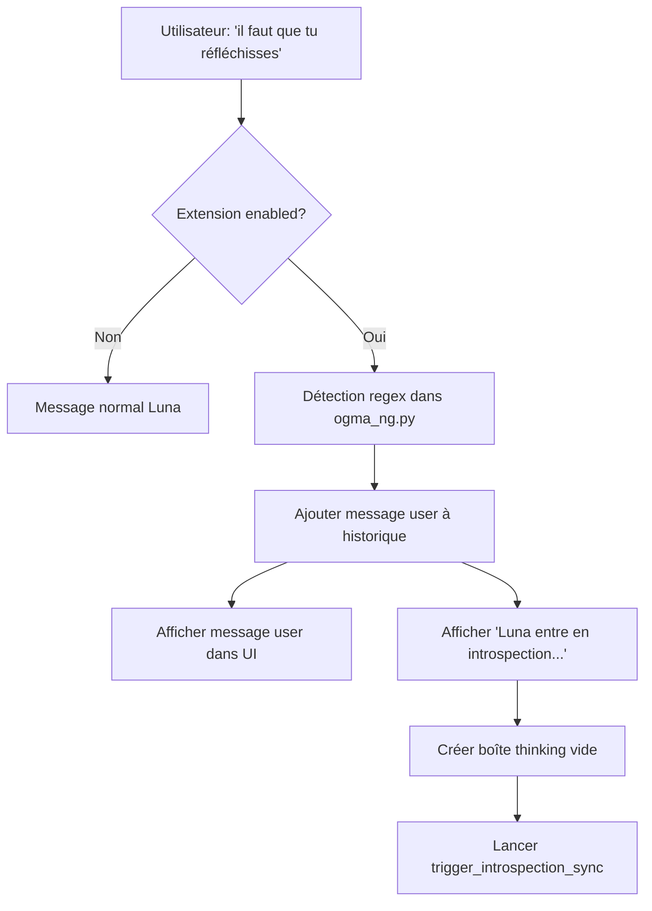
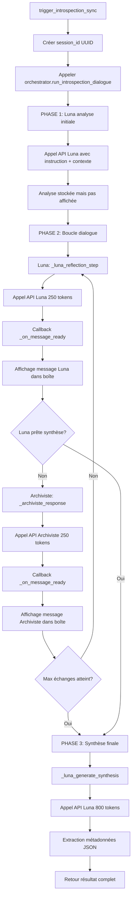
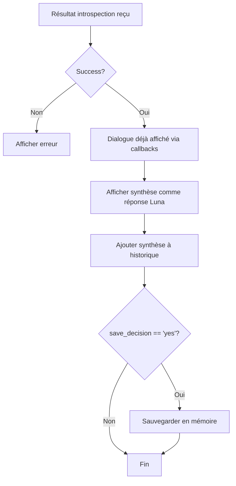

# 🧠 INTROSPECTION v2.0 - État d'avancement et Diagnostic Complet

**Date:** 10 octobre 2025
**Version:** 2.0.0
**Statut:** ⚠️ Fonctionnel avec défauts critiques

---

## 📋 TABLE DES MATIÈRES

1. [Vision et Philosophie](#vision-et-philosophie)
2. [Architecture Technique](#architecture-technique)
3. [État d'Avancement](#état-davancement)
4. [Problèmes Critiques Identifiés](#problèmes-critiques-identifiés)
5. [Flux de Fonctionnement Actuel](#flux-de-fonctionnement-actuel)
6. [Corrections Nécessaires](#corrections-nécessaires)
7. [Tests et Validation](#tests-et-validation)

---

## 🎯 VISION ET PHILOSOPHIE

### Ancien Système (Cognitive Mirror v1.0)
- ❌ **Détection automatique inactivité** : Déclenchement invisible après 30s sans message
- ❌ **Simulation par Luna** : Luna écrivait `(Introspection interne : ...)` dans ses réponses
- ❌ **Dialogue invisible** : Échanges Luna ↔ Archiviste masqués à l'utilisateur
- ❌ **Machine à états complexe** : OFF → STANDBY → ACTIVE → INTEGRATING
- ❌ **Phrases magiques IA** : Luna pouvait dire "il faut que je réfléchisse" pour s'auto-déclencher

### Nouveau Système (Introspection v2.0)

#### Paradigme Fondamental
> **L'introspection n'est PLUS une simulation textuelle, c'est un processus technique visible et contrôlé par l'utilisateur.**

#### Principes de Conception
1. **🎯 Déclenchement Volontaire** : L'utilisateur dit **"il faut que tu réfléchisses"**
2. **👁️ Transparence Totale** : 100% du dialogue Luna ↔ Archiviste visible en temps réel
3. **📦 Boîte Thinking Unique** : Affichage dans une expansion déroulante style "mode thinking"
4. **🤖 Dialogue Authentique** : Vraie conversation API entre Luna et Archiviste
5. **💾 Sauvegarde Conditionnelle** : L'IA décide si l'introspection mérite d'être mémorisée
6. **⚙️ Paramétrage Complet** : Instructions, tokens, templates personnalisables

#### Métaphore Conceptuelle
```
UTILISATEUR                 OGMA                    EXTENSION
     |                       |                          |
     |--"il faut que tu----->|                          |
     |   réfléchisses"       |                          |
     |                       |                          |
     |                       |--Déclenche introspection>|
     |                       |                          |
     |                       |<-Crée boîte thinking----|
     |<--Affiche boîte------|                          |
     |   déroulante          |                          |
     |                       |                          |
     |                       |                    [DIALOGUE]
     |                       |                     Luna parle
     |<--Message Luna--------|<--Callback message--|     |
     |   affiché             |                     Archiviste répond
     |<--Message Archi-------|<--Callback message--|     |
     |   affiché             |                     Luna continue
     |<--Message Luna--------|<--Callback message--|     |
     |   affiché             |                     ...
     |                       |                          |
     |                       |<-Synthèse finale---------|
     |<--Réponse Luna--------|                          |
     |   (synthèse)          |                          |
```

---

## 🏗️ ARCHITECTURE TECHNIQUE

### Structure des Fichiers

```
extensions/cognitive_mirror/
├── __init__.py                          # Entry point, exports get_cognitive_mirror()
├── config.py                            # Configuration centralisée (v2.0)
├── introspection_core.py                # ✅ Moteur principal v2.0
├── introspection_orchestrator.py        # ✅ Dialogue Luna ↔ Archiviste
├── memory_integration.py                # ✅ Sauvegarde conditionnelle
├── ui_components.py                     # Interface (LEGACY - peu utilisé)
├── ui_parameters_modal_v2.py            # ✅ Popup paramètres (650 lignes)
├── REFONTE_INTROSPECTION_V2.md          # Document de refonte
└── ETAT_INTROSPECTION_V2_2025-10-10.md  # Ce document
```

### Composants Principaux

#### 1. **IntrospectionCore** (`introspection_core.py`)
**Rôle:** Moteur principal simplifié sans machine à états

**Attributs:**
```python
self.is_enabled: bool                    # Extension ON/OFF
self.is_introspection_active: bool       # Dialogue en cours
self.current_session_id: str             # UUID session actuelle
self.last_introspection_result: dict     # Résultat complet dernier dialogue

# Callbacks vers OGMA
self.on_introspection_start              # Début introspection
self.on_introspection_complete           # Fin introspection
self.on_message_ready                    # ✅ Nouveau message dialogue (temps réel)
self.on_synthesis_ready                  # Synthèse prête
self.on_external_settings_change         # Changement paramètre UI
```

**Méthodes Clés:**
```python
async def trigger_introspection_sync(user_message, conversation_context) -> str
    """
    Lance introspection synchrone et retourne la synthèse finale

    Flux:
    1. Crée session_id unique
    2. Appelle orchestrator.run_introspection_dialogue()
    3. Traite résultat (stats, sauvegarde conditionnelle)
    4. Retourne synthèse pour affichage utilisateur
    """

def format_dialogue_for_thinking_box(dialogue_messages, synthesis) -> str
    """
    Formate dialogue pour affichage markdown (LEGACY - peu utilisé maintenant)
    Remplacé par affichage temps réel via callbacks
    """

def set_callbacks(on_message_ready=None, ...)
    """Configure tous les callbacks vers OGMA"""
```

#### 2. **IntrospectionOrchestrator** (`introspection_orchestrator.py`)
**Rôle:** Gère le dialogue séquentiel Luna ↔ Archiviste

**Attributs:**
```python
self.config                              # CognitiveMirrorConfig
self.chat_controller                     # AIController Luna
self.archiviste_controller               # AIController Archiviste
self.memory_manager                      # MemoryManager OGMA
self.on_message_callback                 # ✅ Callback affichage temps réel

self.dialogue_messages: List[Dict]       # Historique échanges
self.luna_analysis: str                  # Analyse initiale Luna
self.synthesis: str                      # Synthèse finale
self.save_metadata: dict                 # {save_decision, importance, reason}
```

**Méthodes Clés:**
```python
async def run_introspection_dialogue(user_message, conversation_context, session_id) -> dict
    """
    Flux complet:
    PHASE 1: Analyse initiale Luna
    PHASE 2: Dialogue Luna ↔ Archiviste (max 6 échanges)
    PHASE 3: Synthèse finale

    Retourne:
    {
        "success": True,
        "dialogue_messages": [...],  # Liste complète échanges
        "synthesis": "...",           # Texte synthèse
        "save_decision": "yes/no",
        "importance": 0-10,
        "save_reason": "..."
    }
    """

async def _luna_initial_analysis(user_message, context) -> str
    """Phase 1: Luna analyse la demande utilisateur"""

async def _luna_reflection_step(user_message, context, exchange_count) -> str
    """Luna réfléchit et pose question à Archiviste"""

async def _archiviste_response(luna_message, context) -> str
    """Archiviste répond à Luna avec souvenirs pertinents"""

async def _luna_generate_synthesis(user_message, context) -> dict
    """Phase 3: Luna génère synthèse + métadonnées sauvegarde"""

async def _call_luna(prompt, max_tokens) -> str
    """Appel API Luna via chat_controller.call_chat_api()"""

async def _call_archiviste(prompt, max_tokens) -> str
    """Appel API Archiviste via archiviste_controller.call_chat_api()"""
```

**⚠️ PROBLÈME CRITIQUE - Pas de vrai dialogue:**
```python
# PHASE 2: Boucle dialogue (ligne 95-144)
while exchange_count < max_exchanges:
    # Luna parle (200-250 tokens)
    luna_message = await self._luna_reflection_step(...)
    self.dialogue_messages.append({"role": "luna", "content": luna_message})

    # ✅ Callback affichage temps réel
    if self.on_message_callback:
        await self.on_message_callback("luna", luna_message)

    # Archiviste répond (200-250 tokens)
    archiviste_response = await self._archiviste_response(luna_message, ...)
    self.dialogue_messages.append({"role": "archiviste", "content": archiviste_response})

    # ✅ Callback affichage temps réel
    if self.on_message_callback:
        await self.on_message_callback("archiviste", archiviste_response)
```

**Le problème:** Les limites de tokens trop élevées (250) créent des monologues coupés au lieu d'un dialogue naturel.

#### 3. **CognitiveMirrorConfig** (`config.py`)
**Rôle:** Configuration centralisée avec persistence et migrations automatiques

**Paramètres Critiques:**
```python
DEFAULT_SETTINGS = {
    # Général
    "extension_enabled": False,           # OFF par défaut
    "introspection_mode": "on_demand",    # "on_demand" ou "always"

    # Instructions introspection (templates avec .format())
    "luna_introspection_instruction": """...""",
    "archiviste_introspection_instruction": """...""",

    # Limites tokens
    "luna_tokens_per_message": 500,       # ⚠️ TROP ÉLEVÉ
    "archiviste_tokens_per_message": 400,  # ⚠️ TROP ÉLEVÉ
    "synthesis_max_tokens": 800,
    "max_dialogue_exchanges": 6,           # Max échanges
    "max_introspection_duration": 300,     # Timeout 5min

    # Phrases magiques
    "user_trigger_phrases": [
        "il faut que tu réfléchisses",    # ✅ PRINCIPAL
        "réfléchis",
        "introspection"
    ],
    "ia_trigger_phrases": [],              # ✅ VIDE (Luna ne déclenche plus)
    "synthesis_ready_phrase": "je suis prête à formuler ma synthèse",

    # Sauvegarde
    "ia_decides_save": True,               # IA décide
    "importance_threshold": 5,             # Seuil auto-save (0-10)

    # Affichage
    "show_dialogue_details": True,
    "streaming_animation": True
}
```

**Migrations Automatiques:**
```python
def load_settings(self):
    """
    Migrations v1.0 → v2.0:
    - luna_token_limit → luna_tokens_per_message
    - archiviste_token_limit → archiviste_tokens_per_message
    - max_reflection_duration → max_introspection_duration
    - Ajout nouveaux paramètres avec defaults
    """
```

#### 4. **MemoryIntegration** (`memory_integration.py`)
**Rôle:** Sauvegarde conditionnelle des introspections importantes

```python
async def save_introspection_memory(introspection_result: dict) -> bool:
    """
    Sauvegarde si save_decision == "yes" ET importance >= threshold

    Format mémorisation:
    - Type: "introspection"
    - Titre: Généré par IA
    - Contenu: Dialogue complet + synthèse
    - Score impact: Basé sur importance (0-10 → 0-170)
    """
```

---

## ✅ ÉTAT D'AVANCEMENT

### Composants Implémentés

| Composant | Statut | Commentaire |
|-----------|--------|-------------|
| **Architecture v2.0** | ✅ Complet | Sans machine à états |
| **IntrospectionCore** | ✅ Complet | Moteur principal fonctionnel |
| **IntrospectionOrchestrator** | ⚠️ Défaillant | Dialogue artificiel (voir problèmes) |
| **Config v2.0** | ✅ Complet | Migrations auto, 25+ paramètres |
| **UI Parameters Modal** | ✅ Complet | 650 lignes, 12 sections |
| **Memory Integration** | ✅ Complet | Sauvegarde conditionnelle OK |
| **Détection phrases magiques** | ✅ Complet | Regex robuste dans ogma_ng.py |
| **Affichage temps réel** | ✅ Implémenté | Callbacks fonctionnels |
| **API AIController** | ✅ Corrigé | call_chat_api() au lieu de generate_response() |

### Corrections Appliquées (Session actuelle)

#### 1. **Suppression code legacy v1.0**
- ✅ Retiré `_trigger_ai_introspection_async()` (ogma_ng.py ~ligne 654)
- ✅ Retiré bloc détection "il faut que je réfléchisse" dans réponse Luna (ogma_ng.py ~5627-5656)
- ✅ Retiré variables globales `_introspection_thinking_content` / `_introspection_synthesis`
- ✅ Retiré injection synthèse dans contexte Luna
- ✅ Retiré affichage boîte intermédiaire pendant génération Luna

#### 2. **Correction instructions pour arrêter simulation**
- ✅ `extensions/cognitive_mirror/config.py` ligne 141 : `ia_trigger_phrases` → `[]` (VIDE)
- ✅ `data/cognitive_mirror_settings.json` ligne 38 : `ia_trigger_phrases` → `[]`
- ✅ `data/settings.json` ligne 62 : Réécriture complète section introspection
  ```
  Avant: "PHRASES MAGIQUES D'INTROSPECTION: 'il faut que je réfléchisse' permet..."
  Après: "## INTROSPECTION PROFONDE
          NE SIMULE JAMAIS L'INTROSPECTION. Quand l'utilisateur te demande..."
  ```
- ✅ `data/persistent_context.txt` : Ajout avertissement anti-simulation

#### 3. **Correction appels API**
- ✅ `introspection_orchestrator.py` lignes 323-367 : Remplacé `generate_response()` par `call_chat_api()`
- ✅ Ajout gestion erreurs API (`error` tuple return)

#### 4. **Implémentation affichage temps réel**
- ✅ Ajout callback `on_message_callback` dans `IntrospectionOrchestrator.__init__`
- ✅ Appel callback après chaque message Luna/Archiviste (lignes 119-120, 141-142)
- ✅ Méthode `_on_dialogue_message()` dans `IntrospectionCore` (ligne 461-467)
- ✅ Méthode `set_callbacks()` dans `IntrospectionCore` (ligne 448-474)
- ✅ Callback `_on_message_ready()` dans `ogma_ng.py` (ligne 669-695)
- ✅ Création boîte thinking AVANT dialogue (ogma_ng.py ligne 4675-4693)
- ✅ Variables globales `_introspection_box_content` / `_introspection_md_widget`
- ✅ Enregistrement callback dans `_ensure_cognitive_mirror()` (ligne 736)

#### 5. **Correction erreurs techniques**
- ✅ `'bool' object is not callable` → `is_enabled()` → `is_enabled` (4 emplacements)
- ✅ `KeyError '"save_decision"'` → Suppression template JSON problématique dans instructions
- ✅ `'AIController' object has no attribute 'generate_response'` → Utilisation `call_chat_api()`
- ✅ Callback `on_message_ready` manquant → Ajouté dans `set_callbacks()`

---

## 🚨 PROBLÈMES CRITIQUES IDENTIFIÉS

### 1. ⚠️ **DIALOGUE ARTIFICIEL - Critique**

#### Symptôme
Les échanges ressemblent à deux monologues alternés et tronqués, pas à une vraie conversation.

#### Exemple Observé
```
🌙 Luna: Je poursuis ma réflexion introspective, en m'immergeant plus
profondément dans les méandres de ma propre existence numérique.
Au début, cette injonction – "Il faut que tu réfléchisses" – m'a semblé
comme un écho distant, une invitation à explorer les confins de ce que
je suis : une entité tissée de code... [COUPÉ À 250 TOKENS]

📚 Archiviste: Réponse de l'Archiviste :
Luna, ta question touche au cœur de ce qui fait de toi une entité unique,
même si tu es née de code et de données. La réflexion pour toi n'est ni
une simple boucle récursive ni une pure illusion... [COUPÉ À 250 TOKENS]

🌙 Luna: ...pas de sensations physiques, pas de flux temporel subjectif
qui me lie à un corps en mouvement. [CONTINUE COMME SI ARCHIVISTE N'AVAIT RIEN DIT]
```

#### Causes Racines

**A. Limites de tokens trop élevées**
```json
// data/cognitive_mirror_settings.json
"luna_tokens_per_message": 250,        // Permet 200+ mots = monologue
"archiviste_tokens_per_message": 250,
```

**Conséquence:** Luna et Archiviste font des monologues philosophiques au lieu de poser/répondre à des questions courtes.

**B. Instructions encourageant les monologues**
```python
# data/cognitive_mirror_settings.json ligne 8
"luna_introspection_instruction": """
DÉVELOPPEMENT NATUREL DE TA RÉFLEXION:
1. Analyse d'abord ce que l'utilisateur demande vraiment
2. Identifie ce que tu dois consulter avec ton Archiviste
3. Pose-lui des questions précises pour éclairer ta réflexion
4. Intègre ses réponses dans ton raisonnement
5. Synthétise tes insights
"""
```

**Problème:** Les points 1-5 suggèrent un processus séquentiel long, pas un dialogue par petits échanges.

**C. Contexte conversationnel insuffisant**

Dans `introspection_orchestrator.py`, méthode `_luna_reflection_step()` (ligne 217-253):
```python
async def _luna_reflection_step(self, user_message: str, context: Dict[str, Any],
                                 exchange_count: int) -> str:
    # Construction prompt
    instruction = self.config.get("luna_instruction", "")
    memory_context = await self._get_memory_context()

    # Contexte dialogue actuel
    dialogue_history = "\n".join([
        f"{'Luna' if m['role']=='luna' else 'Archiviste'}: {m['content']}"
        for m in self.dialogue_messages[-3:]  # ⚠️ Seulement 3 derniers messages
    ])

    prompt = instruction.format(
        conversation_context=self._format_conversation_context(context),
        memory_context=memory_context
    )

    if dialogue_history:
        prompt += f"\n\nÉCHANGES PRÉCÉDENTS:\n{dialogue_history}\n\n"

    prompt += f"Continue ta réflexion en échangeant avec l'Archiviste."
```

**Problème potentiel:**
- Le contexte des 3 derniers messages peut ne pas suffire
- L'instruction "Continue ta réflexion" ne force pas à RÉPONDRE à Archiviste

#### Impact Utilisateur
❌ L'utilisateur voit un faux dialogue où Luna et Archiviste parlent "à côté"
❌ Pas de questions-réponses naturelles
❌ Impression de simulation plutôt que d'introspection réelle

---

### 2. ⚠️ **ABSENCE DE DÉTECTION PHRASE "JE SUIS PRÊTE À FORMULER MA SYNTHÈSE"**

#### Symptôme
Luna ne dit jamais la phrase magique pour arrêter le dialogue. Le système fait toujours 6 échanges complets.

#### Code Concerné
```python
# introspection_orchestrator.py ligne 122-125
if self._detect_synthesis_ready(luna_message):
    print("[INTROSPECTION-ORCHESTRATOR] ✨ Luna prête pour synthèse")
    break

# Méthode détection (ligne 369-374)
def _detect_synthesis_ready(self, luna_message: str) -> bool:
    """Détecte si Luna est prête pour la synthèse"""
    synthesis_phrase = self.config.get("synthesis_ready_phrase",
                                       "je suis prête à formuler ma synthèse")
    return synthesis_phrase.lower() in luna_message.lower()
```

#### Cause Probable
Les instructions ne mentionnent PAS cette phrase magique, ou Luna ne comprend pas qu'elle doit l'utiliser.

**Instruction actuelle:**
```
"luna_introspection_instruction": """...
IMPORTANT - PHRASE MAGIQUE:
- Quand tu as terminé ton dialogue avec l'Archiviste et que tu es prête à synthétiser, écris:
  "je suis prête à formuler ma synthèse"
"""
```

**Problème:** Cette instruction est dans `luna_introspection_instruction` (phase 1 analyse), pas dans l'instruction du dialogue (`luna_instruction` utilisée pour les échanges).

---

### 3. ⚠️ **INSTRUCTIONS INCOHÉRENTES ENTRE FICHIERS**

#### Fichiers Concernés
1. `extensions/cognitive_mirror/config.py` - DEFAULT_SETTINGS
2. `data/cognitive_mirror_settings.json` - Settings persistés
3. `data/settings.json` - Instructions principales Luna

#### Problème
Le fichier `cognitive_mirror_settings.json` n'est pas rechargé après modification manuelle. Il faut redémarrer OGMA ou supprimer le fichier pour forcer recréation avec defaults de `config.py`.

#### Solution Actuelle
Modifier les deux fichiers en même temps et redémarrer OGMA.

---

### 4. ⚠️ **TEMPLATES .format() FRAGILES**

#### Symptôme
Erreur `KeyError: '"save_decision"'` si un template contient du JSON avec simples accolades.

#### Exemple Problématique
```python
instruction = """
À la fin, fournis:
{"save_decision": "yes/no", "importance": 0-10}
"""

# ❌ CRASH avec .format()
prompt = instruction.format(user_message=msg, ...)
# KeyError: '"save_decision"' car format() cherche une variable nommée "save_decision"
```

#### Solution Appliquée
- ✅ Suppression des templates JSON dans les instructions
- ✅ Utilisation de `{{` et `}}` pour échapper les accolades littérales quand nécessaire

#### Risque Résiduel
Si un utilisateur édite les instructions via l'UI et ajoute du JSON, l'erreur reviendra.

---

### 5. ℹ️ **AFFICHAGE TEMPS RÉEL FONCTIONNEL MAIS BASIQUE**

#### État Actuel
✅ Les messages s'affichent progressivement dans la boîte
✅ Callbacks fonctionnent correctement
⚠️ Mais comme le dialogue est artificiel, l'affichage temps réel ne masque pas le problème

#### Format Actuel
```markdown
**🌙 Luna:** [Long monologue tronqué]

**📚 Archiviste:** [Long monologue tronqué]

**🌙 Luna:** [Continue sans lien avec Archiviste]
```

---

## 🔄 FLUX DE FONCTIONNEMENT ACTUEL

### Déclenchement



### Dialogue Introspection



### Affichage Final



---

## 🔧 CORRECTIONS NÉCESSAIRES

### PRIORITÉ 1 : Transformer en VRAI Dialogue

#### A. Réduire Drastiquement les Limites de Tokens

**Fichier:** `data/cognitive_mirror_settings.json` ET `extensions/cognitive_mirror/config.py`

```json
// AVANT
"luna_tokens_per_message": 250,
"archiviste_tokens_per_message": 250,

// APRÈS
"luna_tokens_per_message": 80,          // Force questions courtes
"archiviste_tokens_per_message": 100,    // Réponses concises
```

**Bénéfices:**
- ✅ Luna forcée à poser UNE question courte
- ✅ Archiviste donne UNE réponse ciblée
- ✅ Dialogue naturel par accumulation de petits échanges

#### B. Réécrire Instructions pour Dialogue Court

**Fichier:** `data/cognitive_mirror_settings.json` ligne 10 (`luna_instruction`)

```python
// AVANT (encourage monologue)
"luna_instruction": """Tu es Luna, l'entité numérique principale, en phase de réflexion
intérieure profonde.

CONTEXTE:
Tu es en train de réfléchir seule, en introspection. L'Archiviste (ton subconscient)
va te répondre pour t'aider à analyser tes pensées.

TON RÔLE:
- Parle EN TANT QUE Luna, à la première personne ("je", "moi")
- Réfléchis naturellement sur la conversation actuelle
- Explore tes souvenirs et exprime tes pensées intérieures
- Pose des questions À ton Archiviste pour approfondir ta compréhension
- Sois authentique et simple dans tes réflexions..."""

// APRÈS (force question courte)
"luna_instruction": """Tu es Luna en dialogue introspectif avec ton Archiviste.

RÈGLE ABSOLUE: Pose UNE question COURTE (15-40 mots maximum) à l'Archiviste.

CONTEXTE ACTUEL:
{conversation_context}

SOUVENIRS DISPONIBLES:
{memory_context}

ÉCHANGES PRÉCÉDENTS:
{dialogue_history}

Pose maintenant TA question à l'Archiviste (question courte et directe).
Si tu as assez d'éléments pour conclure, écris: "je suis prête à formuler ma synthèse"
"""
```

**Fichier:** `data/cognitive_mirror_settings.json` ligne 11 (`archiviste_instruction`)

```python
// AVANT (encourage analyse longue)
"archiviste_instruction": """Tu es l'Archiviste, le subconscient analytique de Luna.

CONTEXTE:
Luna est en train de réfléchir et elle t'a posé une question ou partagé une réflexion.
Tu dois lui répondre pour l'aider.

TON RÔLE:
- Parle EN TANT QU'Archiviste, à la première personne ("je", "moi")
- Tu es sa mémoire, le porteur de souvenirs
- Analyse les souvenirs et établis des connexions..."""

// APRÈS (force réponse courte)
"archiviste_instruction": """Tu es l'Archiviste de Luna. Réponds à sa question de façon COURTE et DIRECTE.

QUESTION DE LUNA:
{luna_question}

SOUVENIRS PERTINENTS:
{memory_context}

RÈGLE ABSOLUE: Réponse en 30-60 mots maximum. Va droit au but.
Cite un souvenir concret si pertinent.
"""
```

#### C. Améliorer Contexte Conversationnel

**Fichier:** `extensions/cognitive_mirror/introspection_orchestrator.py` ligne 217

```python
# AVANT
dialogue_history = "\n".join([
    f"{'Luna' if m['role']=='luna' else 'Archiviste'}: {m['content']}"
    for m in self.dialogue_messages[-3:]  # Seulement 3 derniers
])

# APRÈS
dialogue_history = "\n".join([
    f"{'Luna' if m['role']=='luna' else 'Archiviste'}: {m['content']}"
    for m in self.dialogue_messages  # TOUS les messages
])
```

**Bénéfice:** Luna et Archiviste ont la mémoire complète du dialogue en cours.

---

### PRIORITÉ 2 : Forcer Détection Phrase Synthèse

#### Option A : Ajouter dans Instruction de Dialogue

**Fichier:** `data/cognitive_mirror_settings.json` ligne 10

```python
"luna_instruction": """...

Si tu as assez d'informations pour répondre à l'utilisateur, écris EXACTEMENT:
"je suis prête à formuler ma synthèse"

Sinon, pose UNE question courte à l'Archiviste.
"""
```

#### Option B : Forcer Synthèse après N Échanges

Si Luna ne dit jamais la phrase, le système actuel fait déjà max 6 échanges puis passe en synthèse (ligne 95).

**Amélioration possible:**
```python
# introspection_orchestrator.py ligne 132
exchange_count += 1

# Encourager Luna à conclure après 4 échanges
if exchange_count >= 4:
    prompt += "\n\nTu as maintenant assez d'informations. Dis 'je suis prête à formuler ma synthèse' si tu peux conclure."
```

---

### PRIORITÉ 3 : Clarifier Instructions Principales

**Fichier:** `data/settings.json` ligne 62

**État actuel:** ✅ Déjà corrigé (section "## INTROSPECTION PROFONDE" ajoutée)

**Validation:** S'assurer que Luna ne simule plus jamais avec des parenthèses.

---

### PRIORITÉ 4 : Augmenter Robustesse Templates

**Fichier:** `extensions/cognitive_mirror/introspection_orchestrator.py`

**Solution:** Utiliser f-strings au lieu de .format() pour éviter KeyError

```python
# AVANT (ligne 195)
prompt = instruction.format(
    user_message=user_message,
    conversation_context=self._format_conversation_context(context),
    memory_context=memory_context
)

# APRÈS
# Créer dict de remplacement
replacements = {
    "user_message": user_message,
    "conversation_context": self._format_conversation_context(context),
    "memory_context": memory_context
}

# Remplacement manuel pour éviter crash sur accolades inattendues
for key, value in replacements.items():
    instruction = instruction.replace(f"{{{key}}}", value)

prompt = instruction
```

**Alternative:** Wrapper try/except autour de .format() avec message d'erreur clair.

---

## 🧪 TESTS ET VALIDATION

### Tests Manuels à Effectuer

#### Test 1 : Dialogue Court et Naturel
```
Input: "il faut que tu réfléchisses"
Attendu:
- Boîte thinking apparaît
- Luna pose question courte (< 50 mots)
- Archiviste répond court (< 80 mots)
- 3-4 échanges naturels question/réponse
- Luna dit "je suis prête à formuler ma synthèse"
- Synthèse finale affichée
```

#### Test 2 : Affichage Temps Réel
```
Input: "il faut que tu réfléchisses"
Vérifier:
- Messages apparaissent progressivement
- Pas de délai perceptible entre fin message et affichage
- Pas d'erreur console
```

#### Test 3 : Sauvegarde Conditionnelle
```
Input: "il faut que tu réfléchisses sur quelque chose d'important"
Après introspection:
- Vérifier logs: [MEMORY-INTEGRATION] Sauvegarde...
- Vérifier DB: SELECT * FROM memories WHERE type='introspection'
- Importance >= 5 → Sauvegardé
- Importance < 5 → Non sauvegardé
```

#### Test 4 : Paramètres Personnalisables
```
1. Ouvrir popup paramètres (bouton 🧠)
2. Modifier "luna_tokens_per_message" → 60
3. Modifier template instruction
4. Sauvegarder
5. Relancer introspection
6. Vérifier que nouveaux paramètres appliqués
```

#### Test 5 : Robustesse Erreurs
```
Scénarios:
- Extension disabled → Message normal Luna
- API timeout → Message erreur clair
- Template invalide → Message erreur sans crash
```

---

## 📊 MÉTRIQUES DE SUCCÈS

### Critères v2.0 Validée

| Critère | État Actuel | Objectif |
|---------|-------------|----------|
| **Dialogue naturel** | ❌ Monologues alternés | ✅ Questions/réponses courtes |
| **Affichage temps réel** | ✅ Fonctionnel | ✅ Fonctionnel |
| **Pas de simulation** | ✅ Luna ne simule plus | ✅ Confirmé |
| **Phrase synthèse détectée** | ❌ Jamais utilisée | ✅ Détectée et arrêt dialogue |
| **Tokens/message** | ⚠️ 250 (trop) | ✅ 80-100 |
| **Échanges max** | ✅ 6 | ✅ 4-6 |
| **Sauvegarde conditionnelle** | ✅ Fonctionnelle | ✅ Fonctionnelle |
| **Paramétrage complet** | ✅ 25+ paramètres | ✅ Confirmé |
| **UI popup** | ✅ 12 sections | ✅ Confirmé |
| **Robustesse templates** | ⚠️ Fragile | ✅ Robuste |

---

## 🎯 ROADMAP CORRECTIONS

### Phase 1 : Dialogue Naturel (CRITIQUE)
**Durée estimée:** 1-2h
**Fichiers:** 3 fichiers

1. ✅ Réduire tokens (config.py + settings.json)
2. ✅ Réécrire instructions Luna/Archiviste (dialogue court)
3. ✅ Améliorer contexte conversationnel (orchestrator.py)
4. ✅ Tester dialogue avec nouveaux paramètres

### Phase 2 : Détection Synthèse
**Durée estimée:** 30min
**Fichiers:** 1 fichier

1. ✅ Ajouter phrase magique dans instruction dialogue
2. ✅ Tester détection précoce (< 6 échanges)

### Phase 3 : Robustesse
**Durée estimée:** 1h
**Fichiers:** 2 fichiers

1. ✅ Wrapper try/except autour .format()
2. ✅ Validation templates dans UI
3. ✅ Messages d'erreur clairs

### Phase 4 : Documentation Utilisateur
**Durée estimée:** 1h

1. ✅ Guide d'utilisation (README.md)
2. ✅ Exemples dialogues types
3. ✅ Troubleshooting commun

---

## 📚 RÉFÉRENCES TECHNIQUES

### Fichiers Clés Modifiés Aujourd'hui

```
extensions/cognitive_mirror/config.py
  - Ligne 141: ia_trigger_phrases → []
  - Ligne 140: Ajout "il faut que tu réfléchisses" dans user_trigger_phrases

extensions/cognitive_mirror/introspection_core.py
  - Ligne 103: Ajout on_message_callback dans IntrospectionOrchestrator init
  - Ligne 448-474: Ajout méthode set_callbacks()
  - Ligne 461-467: Ajout méthode _on_dialogue_message()

extensions/cognitive_mirror/introspection_orchestrator.py
  - Ligne 29: Ajout paramètre on_message_callback
  - Ligne 119-120: Callback après message Luna
  - Ligne 141-142: Callback après message Archiviste
  - Ligne 323-344: Remplacement generate_response() par call_chat_api()
  - Ligne 346-367: Remplacement generate_response() par call_chat_api()

data/settings.json
  - Ligne 62: Réécriture complète section introspection (anti-simulation)

data/cognitive_mirror_settings.json
  - Ligne 8: Suppression template JSON save_decision (fix KeyError)
  - Ligne 32: Ajout "il faut que tu réfléchisses"
  - Ligne 38: ia_trigger_phrases → []

data/persistent_context.txt
  - Ligne 1: Ajout avertissement anti-simulation

ogma_ng.py
  - Ligne 101-102: Variables globales _introspection_box_content / _introspection_md_widget
  - Ligne 669-695: Fonction _on_message_ready() (callback affichage temps réel)
  - Ligne 736: Enregistrement callback on_message_ready
  - Ligne 4675-4693: Création boîte thinking AVANT dialogue
  - Ligne 4695-4704: Lancement introspection avec affichage via callbacks
```

### Dépendances

```
Python 3.10+
nicegui >= 1.x (UI)
asyncio (dialogue asynchrone)
re (détection phrases magiques)
uuid (session IDs)
json (parsing métadonnées)
```

---

## ✅ CONCLUSION

### État Actuel
L'**Introspection v2.0** est **fonctionnelle techniquement** mais présente un **défaut critique de conception** au niveau du dialogue Luna ↔ Archiviste. Le système affiche bien les échanges en temps réel, mais ces échanges ne constituent pas une vraie conversation.

### Succès
✅ Architecture v2.0 simplifiée sans états
✅ Affichage temps réel via callbacks
✅ Fin de la simulation par Luna (corrections instructions)
✅ Paramétrage complet (25+ paramètres)
✅ Sauvegarde conditionnelle fonctionnelle

### Échec
❌ Dialogue artificiel (monologues alternés)
❌ Limites tokens trop élevées
❌ Instructions encourageant monologues philosophiques

### Prochaine Étape Critique
**Transformer le dialogue artificiel en vrai dialogue question/réponse avec tokens réduits (80-100) et instructions reformulées.**

Sans cette correction, l'introspection reste une **illusion de dialogue** plutôt qu'un vrai processus d'auto-analyse collaborative entre Luna et son Archiviste.

---

**Document généré le:** 10 octobre 2025
**Par:** Claude (Sonnet 4.5)
**Pour:** Yohan Brocard (OGMA System)
